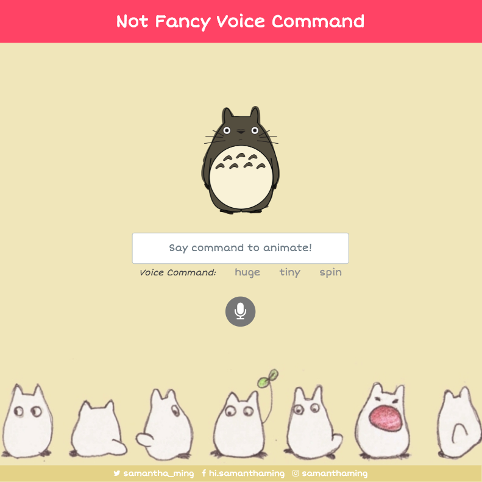
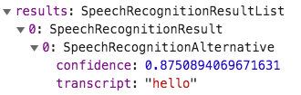

# Not Fancy 

A simple, not fancy at all, voice command. Animate the Totoro image with your voice!

**Features include:**
- Make the image respond to the corresponding voice command.
- Turn on/off the mic.
- Display the spoken text on the screen.

**Built using:**
- Vue
- Web Speech API
- Google Fonts - Short Stack

<br>

Play around with it on [CodePen](https://codepen.io/samanthaming/pen/)  
Or see it live! [here](https://samanthaming.github.io/not-fancy-voice-command/)

<br>



# Notes

Here are the general steps to create your own Not Fancy Voice Command.

- Setup SpeechRecognization
- Display Transcript
- Respond to Command
- Turn mic on/off
- Keep listening


## 1. Setup SpeechRecognition

This is the basic to get your SpeechRecognition working!

```javascript
// We're putting it outside the Vue object 
//  to make it accessible in the different methods
const SpeechRecognition = window.SpeechRecognition || window.SpeechRecognition;
const recognition = new SpeechRecognition;

new Vue({
  methods: {
    startSpeech() {
      recognition.lang = 'en-US';
      recognition.interimResults = true;
  
      recognition.addEventListener('result', e => {
        console.log(e.results);
      });
  
      recognition.start();
    }
  }
})
```

Your `e.results` will look like this



## 2. Display the Spoken Words

Let's display our results. Our results is quite nested, so we will need to do a few loops to pull out our transcript.

```javascript
data: {
  message: ''
},
methods: {
  startSpeech() {
    recognition.addEventListener('result', (e) => {
      const transcript = Array.from(e.results)
        .map(result => result[0])
        .map(result => result.transcript)
        .join('');
      
      this.message = transcript;
    });
  }
}
```

## 3. Create our Voice Command

We're going to create the list voice command that we want our Totoro image to respond to. If the user says those specific word, we'll save it to our data.

```javascript
data: {
  command: [
    'huge',
    'tiny',
    'spin'
  ],
  animate: ''
},
methods: {
  startSpeech() {
    //...

    recognition.addEventListener('result', (e) => {
      // ...

      this.commands.forEach(command => {
        if(transcript.includes(command)) {
          
          this.animate = command;
          
          // Reset the animate after 1.1s
          setTimeout(() => {
            this.animate = '';
          }, 1100);
        }
      })
    });
  },
}
```

In our HTML file, we'll trigger a class that will animate the image.

```html

```

And in our CSS file, we'll add our animation.

```css
.shape.huge {
  animation: grow 1s;
}
}
@keyframes grow {
  0% {
    transform: scale(1);
  }
  100% {
    transform: scale(2.5);
  }
}
```

## 4. Keep Listening

The SpeechRecognition default to a single result. Meaning once a result is returned, it will stop listening. To get the SpeechRecognition to continue listening, we're going to start up a speech recognition service once it ends. To do this, we're going to create an event listener that will fire `SpeechRecognition.start()` when the speech recognition service has disconnected (when the `end` event fires).

Note I doing this `recognition.start` and NOT `recognition.start()`. If I use the latter, it will execute right away. I want it to execute when the `end` event gets fired and not immediately.

```javascript
methods: {
  startSpeech() {
    // ...
    recognition.addEventListener('end', recognition.start);
  }
}
```

Note: there is a `continuous` property of the SpeechRecognition that we can utilize to keep listening. But because I only want to display the most recent text, I'm not using this method. Because of the 24hrs time constraint of the #NotFancyAppChallenge, I ran out of time to experiment this method. Maybe for another challenge, I will get this property a try 😉

[MDN: SpeechRecognition.continuous](https://developer.mozilla.org/en-US/docs/Web/API/SpeechRecognition/continuous)

## 5. Turning the Mic on/off

This step is optional. The app should be working just fine without this. But if you want to create a mic on/off toggle, read on!

I need to remove the `end` event listener when the user toggle off the mic. Otherwise, this event listener will keep going on and listening forever 😱 To do that I'm going to create a named function outside of the Vue object. This way I can access it in both the `startSpeech()` and `endSpeech()` method.

```javascript
function keepListening() {
  recognition.start();
}
new Vue({
  data: {
    isMicOn: false,
  },
  methods: {
    toggleMic() {
      this.isMicOn = !this.isMicOn;
      this.isMicOn ? this.startSpeech() : this.endSpeech();
    },
    startSpeech() {
      // ...
      recognition.addEventListener('end', keepListening)
    },
    endSpeech() {
      recognition.stop();
      recognition.removeEventListener('end', keepListening)
    }
  }
})
```

## How to use the Speech Recognition Event Handlers

You can see the MDN docs for a [list](https://developer.mozilla.org/en-US/docs/Web/API/SpeechRecognition#Event_handlers) of all the event handlers on the SpeechRecognition object.

You will notice all the handlers are prefixed with the `on` word. When you're using it in the `addEventListener` method, you don't need the `on` prefix. For example, use `result` instead of `onresult`.

Here is the syntax:

```javascript
target.addEventListener(type, listener[, options]);
```

# Resources

- [CodePen: Speech to text with Vue and Vuetify using Web SpeechRecognition](https://codepen.io/JamieCurnow/pen/ZoxVQg)
- [MDN: Speech Recognition](https://developer.mozilla.org/en-US/docs/Web/API/SpeechRecognition)
- [MDN: Web Events](https://developer.mozilla.org/en-US/docs/Web/Events)
- [JavaScript30: Speech Detection](https://github.com/wesbos/JavaScript30/blob/master/20%20-%20Speech%20Detection/index-FINISHED.html)

# Images

- [Totoro by chloevictoria](https://www.deviantart.com/chloevictoria/art/Totoro-211807815)
- [Background by Iriname](https://www.deviantart.com/iriname/art/TOTORO-217717011)
